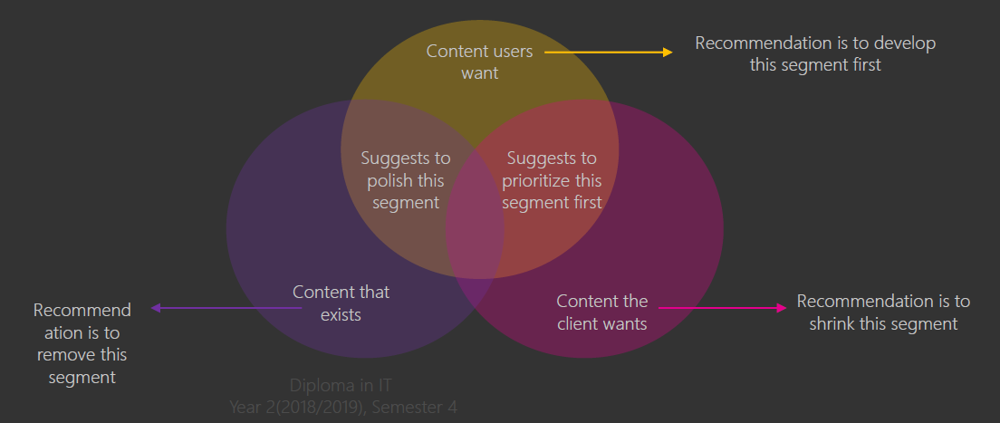
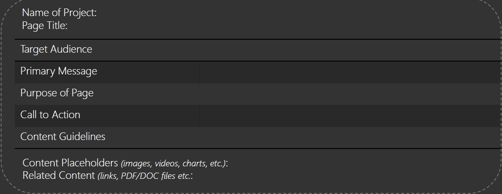
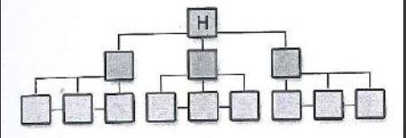
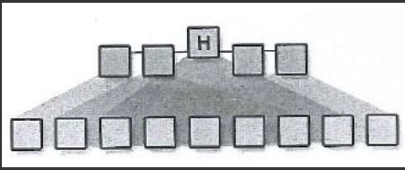
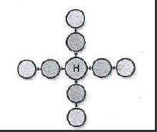
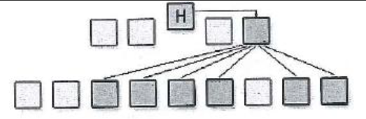
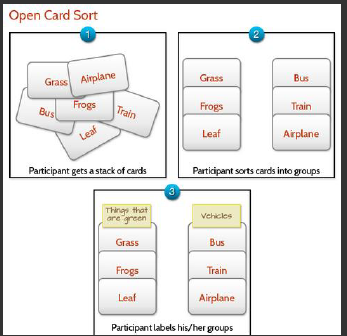
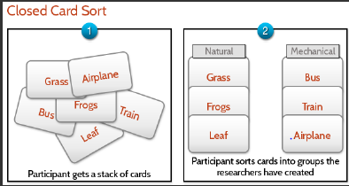

# What makes up the Analyse Stage?
Content Strategy and Content Organisation Techniques

## What is content strategy?
It focuses on planning, creation and delivery of content. So that we can structure our useful and useable content to be easily found, improving the user experience.
There are five strategies:

- Inventory
- Audit
- Templates
- Editorial calendar
- Flow of Content

### Content Inventory
It catalogues the entire content of the website which includes; text,images,documents and application.
We will take stock to find out what content we have, how is it organized, who created it and where is it located at.

### Content Audit
It evaluates the content by assessing its quality and effectiveness that can be broken down into:

- The message of the content
- The accuracy and usefulness
- Is the content written professionally and used by your audience and is it user-friendly

Content audit can provide insights into

- What parts of the site attract and drive users away
- What pages needs to be be consolidated to prevent overlap
- Which part is irrelavent so that it can be removed
- Which content or page engages users the most
- Which pain points that you can fix

The content can be evaluated in three different ways

- What users want
- What contents exist
- What content the clients wants.

### Content Template
It is templates that reference what information the site has and in what format

### Editorial Calendar
Used to organize and catergorize the content which marketers plan to publish. They will factor in pioritized list of what to publish, effort required, the destination of publishing and the dates meant for writing, editing and publishing.
The tools they use are spreadsheet, google calendar and etc...
### Content Flow
Analyses the entire creation and movement of content.

## Content Organisation Techniques  
- Information Architecture
- Card Sorting
- Site-map

### Information Architecture
It is a way to structure and classify sites to help people find and manage information. 
A Information Architect transforms data into understandable information structure that is site maps to allow users to find path to information and they identify relationship between information and cross references. Tools they use sis XMind.

### Sitemap Models
[a link](https://webdesignfromscratch.com/website-architecture/ia-models/)
There are four site map models:
* Strict singular Hierarchy  

* Multi Dimensional   

* Hub Model  

* Search Driven Model  

### Card Sorting  
* Open Sort
  * They are good for new navigational structures or restructuring existing navigation structure. It is done by grouping cards and categorizing them.

* Closed Sort
  * They are good for validating existing site maps or when adding more content to the site map. It is done by providing high level categories and sorting the card accordingly.  

